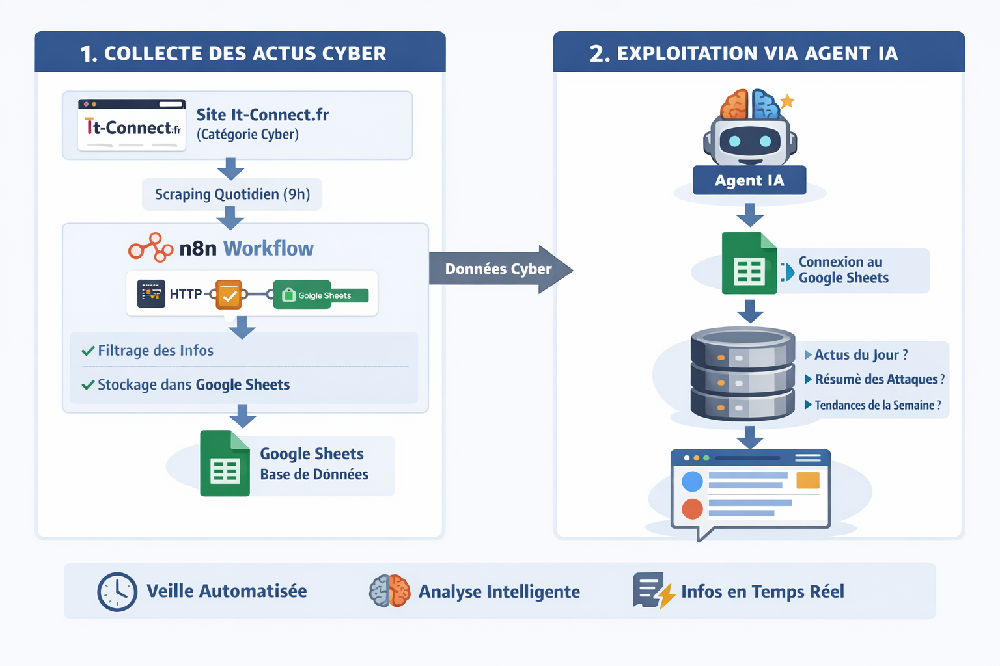

# chat-with-news
workflows n8n pour parler avec une ia sur les actualités cyber

👉 Objectif : ne plus jamais rater une actu cyber… et pouvoir les interroger intelligemment.

---

## 🔎 1) Collecte automatique des actus cyber

Chaque matin à 9h :

- Scraping des actualités depuis **it-connect.fr** (catégorie cyber uniquement)
- Filtrage des infos pertinentes
- Stockage automatique dans un **Google Sheet**

💡 Résultat : une base de données toujours à jour, sans effort manuel.

---

## 🤖 2) Exploitation avec un agent IA

Ensuite, j’ai connecté ce Google Sheet à un agent IA.

👉 Ce que ça permet :

- “Donne-moi les actus cyber du jour”
- “Fais-moi un résumé des dernières attaques”
- “Quelles tendances cette semaine ?”

💡 L’IA ne devine pas : elle s’appuie directement sur les données collectées.

---

## ⚡ Pourquoi c’est puissant ?

- ⏱ Gain de temps énorme (veille automatisée)
- 🧠 Accès intelligent à l’info (via IA)
- 🔄 Système évolutif (autres sources, enrichissement, scoring…)